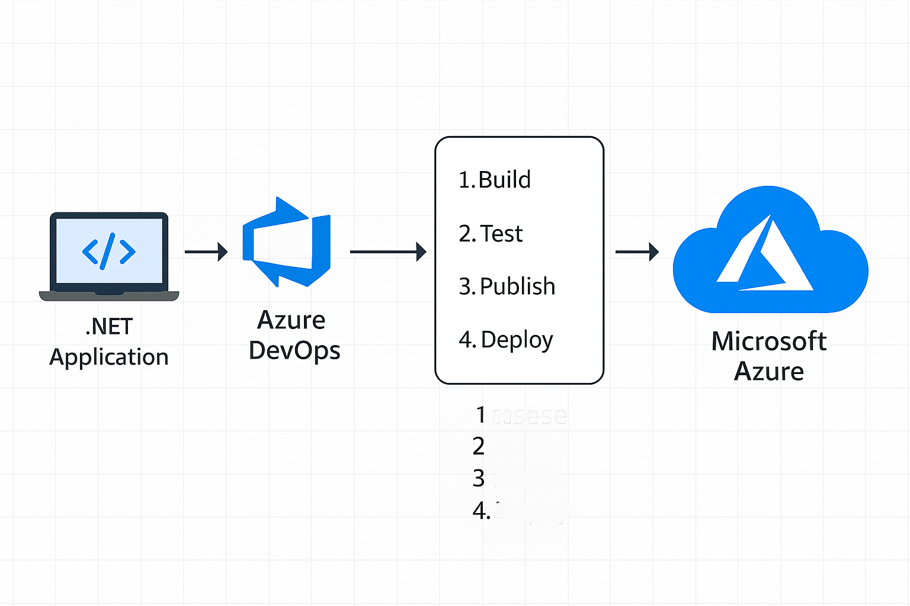

# CI/CD for .NET App using Azure DevOps

This project demonstrates a simple CI/CD pipeline for a .NET Core application using Azure DevOps Pipelines.

## 📦 Tech Stack

- .NET Core
- Azure DevOps
- YAML Pipelines
- GitHub

## 🚀 Pipeline Stages

- Checkout Code
- Install SDK
- Build Project
- Run Unit Tests

## 📂 Pipeline File

The Azure DevOps pipeline is defined in `.azure-pipelines/azure-pipelines.yml`.

## 📸 Diagram

---
👤 Author: [Rukesh Dasari](https://github.com/rukesh24)
